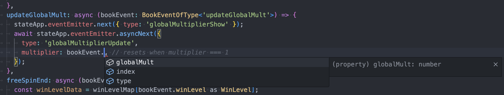

# Új BookEvent hozzáadásának lépései

Ebben az útmutatóban végigmegyünk egy új `BookEvent` implementálásának folyamatán egy példán keresztül. Tételezzük fel, hogy hozzáadtunk egy `updateGlobalMult` nevű eseményt a bónusz játékhoz (`MODE_BONUS`) a matematikai motorban, amely egy globális szorzó funkciót vezet be.

## 1. Mock adatok frissítése (RGS szimuláció)

Az SDK Storybook környezete statikus fájlokból szimulálja az RGS válaszait.

* **`/apps/lines/src/stories/data/bonus_books.ts`**: Ez a fájl tartalmazza a bónusz könyveket (books), amelyeket a Storybook véletlenszerűen választ ki. Másoljuk be ide az új eseményt a matematikai csomagunkból:
    ```typescript
    {
      type: 'updateGlobalMult',
      globalMult: 3,
    }
    ```
* **`/apps/lines/src/stories/data/bonus_events.ts`**: Itt tároljuk az egyedi eseményeket a teszteléshez. Adjuk hozzá az új típust:
    ```typescript
    updateGlobalMult: {
      type: 'updateGlobalMult',
      globalMult: 3,
    },
    ```

## 2. Storybook integráció

* **`/apps/lines/src/stories/ModeBonusBookEvent.stories.svelte`**: Ez a fájl implementálja a bónusz események al-történeteit. Az alábbi kód hozzáadásával egy új gomb jelenik meg a Storybookban, amivel izoláltan tesztelhetjük az eseményt:
    ```svelte
    <Story
      name="updateGlobalMult"
      args={templateArgs({
        skipLoadingScreen: true,
        data: events.updateGlobalMult,
        action: async (data) => await playBookEvent(data, { bookEvents: [] }),
      })}
    />
    ```

## 3. TypeScript típusok definiálása

A típusbiztonság és az Intellisense támogatás érdekében frissítenünk kell a típusleírókat.

* **`/apps/lines/src/game/typesBookEvent.ts`**: Adjuk hozzá az új esemény interfészét a `BookEvent` union típushoz:
    ```typescript
    type BookEventUpdateGlobalMult = {
      index: number;
      type: 'updateGlobalMult';
      globalMult: number;
    };

    export type BookEvent = | ... | BookEventUpdateGlobalMult | ... ;
    ```

## 4. Eseménykezelő (Handler) beállítása

* **`/apps/lines/src/game/bookEventHandlerMap.ts`**: Itt regisztráljuk a konkrét logikát, ami lefut az esemény érkezésekor. A TypeScript segítségével itt már látni fogjuk az esemény mezőit.



## 5. Komponens és EmitterEventek

Technikailag minden, a globális szorzóhoz kapcsolódó vizuális feladatnak egy dedikált Svelte komponensben kell helyet kapnia.

* **`/apps/lines/src/components/GlobalMultiplier.svelte`**: Hozzuk létre a komponenst és definiáljuk az emitter eseményeket:
    ```svelte
    <script lang="ts" module>
      export type EmitterEventGlobalMultiplier =
        | { type: 'globalMultiplierShow' }
        | { type: 'globalMultiplierHide' }
        | { type: 'globalMultiplierUpdate'; multiplier: number };
    </script>
    ```

* **`/apps/lines/src/game/typesEmitterEvent.ts`**: Regisztráljuk az új emitter eseményt a globális játék-események közé:
    ```typescript
    import type { EmitterEventGlobalMultiplier } from '../components/GlobalMultiplier.svelte';
    export type EmitterEventGame = | ... | EmitterEventGlobalMultiplier | ... ;
    ```

* **`/apps/lines/src/game/eventEmitter.ts`**: Győződjünk meg róla, hogy az `eventEmitter` exportálva van és használja a frissített típusokat.

## 6. Vizuális logika implementálása

Térjünk vissza a komponensünkhöz, és iratkozzunk fel az eseményekre:

```svelte
<script lang="ts">
  context.eventEmitter.subscribeOnMount({
    globalMultiplierShow: () => (show = true),
    globalMultiplierHide: () => (show = false),
    globalMultiplierUpdate: async (emitterEvent) => {
      console.log(emitterEvent.multiplier);
      // Animációs logika helye (pl. Spine)
    },
  });
</script>

<SpineProvider key="globalMultiplier" width={PANEL_WIDTH}>
  <SpineTrack trackIndex={0} {animationName} />
</SpineProvider>
```

## 7. Tesztelés
Izolált teszt: Futtassuk a Storybookot, és válasszuk a MODE_BONUS/bookEvent/updateGlobalMult menüpontot. Kattintsunk az Action gombra. A komponensnek megfelelően kell animálnia, majd meg kell jelennie az "Action is resolved ✅" üzenetnek.

Komplex teszt: Váltsunk a MODE_BONUS/book/random nézetre. Mivel frissítettük a bonus_books.ts fájlt, az új esemény véletlenszerűen fel fog bukkanni a teljes bónusz kör lejátszása során.