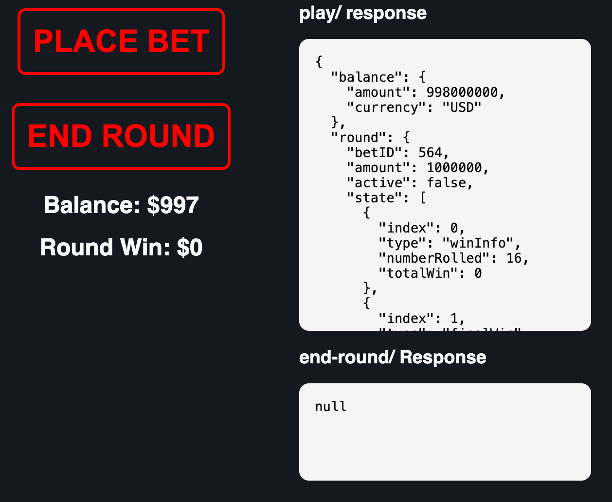

# Western Shootout - RGS Válaszok Kezelése

Ez a rövid útmutató segít elindulni az RGS használatában a **Western Shootout** mintajátékon keresztül.

### Játék Áttekintés

A mechanika a párbaj alapú logikára épül:
* Lekérsz egy választ az RGS `/play` API-jától.
* A szimuláció eredményétől függően:
  * **Nyeremény**: A játékos legyőzi az ellenfelet (vagy angyal segíti), és a szorzónak megfelelő összeget kap.
  * **Veszteség**: A játékos HP-ja elfogy a párbaj során.

Az egyenleged és a kör kimenete a felületen jelenik meg. A körhöz tartozó JSON válasz a képernyő jobb oldalán látható.

Ha a **nyeremény nagyobb, mint 0**, manuálisan meg kell hívnod az `/end-round` API-t a fogadás lezárásához és az egyenleg frissítéséhez — pontosan úgy, mint egy éles frontend implementációban.

> További információért lásd: [RGS Technikai Részletek](../rgs_docs/RGS.md).

---

## Matematikai Eredmények Generálása

Navigálj a `math-sdk/games/western_shootout/` könyvtárba, és futtasd a `run.py` szkriptet. Ez létrehozza az alábbiakat:

* **Zstandard-tömörített** szimulációs eredmények (`.jsonl.zst`).
* Egy **lookup table** (CSV), amely minden eredményt a szimulációjához rendel.
* A kötelező `index.json` konfigurációs fájl.

A játék **Stake Engine**-re történő publikálásához szükséges összes fájl a `library/publish_files/` mappába kerül.

---

## Egyszerű Frontend Implementáció

A kliensoldalhoz **Svelte 5**-öt használunk **Vite**-tel csomagolva. A projektet **NPM** segítségével inicializáljuk.

> **Megjegyzés**: Az útmutató az NPM `v22.16.0` verzióját feltételezi.

### Beállítási Lépések

1. **Vite projekt létrehozása**:
   `npm create vite@latest`

2. **A `vite.config.ts` szerkesztése**:
   Győződj meg róla, hogy a `defineConfig` függvény tartalmazza a `base: "./"` beállítást a pluginok alatt.

3. **Stílusok és fő komponens cseréje**:
   * Másold a [`css.txt`](css.txt) tartalmát a generált `app.css` fájlba.
   * Cseréld le az `src/App.svelte` tartalmát a [`app_svelte.txt`](app_svelte.txt) fájlban található kódra.

4. **Build folyamat**:
   `yarn build`

5. **Telepítés**:
   * Töltsd fel a `dist/` mappa tartalmát a Stake Engine-be a *frontend files* szekció alá.

---

## A Frontend Működése

Ez az egyszerű Svelte alkalmazás az alábbiakat végzi el:

* Hitelesíti a munkamenetet az RGS-nél.
* Választ kér a `/play` API-tól.
* Nyeremény esetén meghívja az `/end-round` API-t a fogadás véglegesítéséhez.

Amint a matematikai és frontend fájlok feltöltésre kerültek a Stake Engine-be, a játék indításakor az alábbi kép fogad:

A **Place BET** gomb megnyomása feltölti a *play/ response* mezőt az RGS körstruktúrájával.
Ha a kör nyereménye > 0, nyomd meg az **END ROUND** gombot a kifizetés jóváírásához és a fogadás lezárásához.